# Rainmaker application audit

**Audit date:** 2026-07-10
**Repository:** EDG-QUOTING
**Audited commit:** `154988e0656c3cfe58cac88c6c661f332a912ae3` on clean `main`, matching `origin/main` at audit start
**Mode:** Read-only product, workflow, UX, data-flow, and technical-risk audit
**Production:** Read-only inspection only; no forms submitted, records edited, emails sent, signatures created, handoffs triggered, or production data changed

**Related plan:** [Rainmaker improvement plan](./IMPROVEMENT-PLAN.md)

**Phase 0 evidence:** [production baseline](./production-baseline-2026-07-10.md), [preservation inventory](./preservation-inventory-2026-07-10.md), and [test baseline](./test-baseline-2026-07-10.md)

**Implementation evidence:** [Completion audit and remaining gates](./completion-audit-2026-07-10.md), [Phase 1A UI cleanup](./phase1-ui-cleanup-2026-07-10.md), [Phase 1C safety fixes](./phase1-safety-fixes-2026-07-10.md), [Phase 2A signed-version immutability](./phase2-signed-immutability-2026-07-10.md), [Phase 2B authoritative customer package](./phase2-customer-package-2026-07-10.md), [Phase 2C package consolidation](./phase2-package-consolidation-2026-07-10.md), [Phase 3A catalog source identity](./phase3-catalog-source-identity-2026-07-10.md), [Phase 3B dimensional-pricing safety](./phase3-dimensional-pricing-2026-07-10.md), [Phase 3C transactional quote import](./phase3-transactional-quote-import-2026-07-10.md), [Phase 4A–4C lead/client and metric truth](./phase4-lead-client-workflow-2026-07-10.md), [Phase 4D usability/accessibility](./phase4d-usability-accessibility-2026-07-10.md), [Phase 5A permissions baseline](./phase5-permissions-baseline-2026-07-10.md), [Phase 5B migration-only schema/readiness](./phase5-schema-readiness-2026-07-10.md), [Phase 5C redacted routine logging](./phase5-redacted-logging-2026-07-10.md), [Phase 5C idempotent signature-email delivery](./phase5-email-delivery-evidence-2026-07-10.md), [Phase 5C email reconciliation](./phase5-email-reconciliation-2026-07-10.md), [Phase 5C confirmation recovery](./phase5-confirmation-recovery-2026-07-10.md), [Phase 5C adoption evidence](./phase5-adoption-evidence-2026-07-10.md), [Phase 5 error-reporting decision gate](./phase5-error-reporting-decision-2026-07-10.md), and [Phase 5D targeted decomposition](./phase5d-targeted-decomposition-2026-07-10.md)

## Executive verdict

Rainmaker is a real, populated production operating system—not an abandoned prototype. The live production UI showed 276 quote rows, 1,148 product rows, 75 lead records, visible versioned quotes, and multiple completed/in-progress signature states on 2026-07-10. The core model—Workspace login, leads/accounts, quote families and versions, catalog pricing, customer approval, and signed customer documents—is worth keeping.

The main problem is lifecycle integrity and workflow truth. The application presents a coherent quote-to-contract flow, but several important boundaries are either misleading or unsafe:

1. A customer can sign a frozen snapshot while staff can still edit the live quote, leaving two conflicting versions of commercial truth.
2. Public signing cannot retrieve product renderings or quote groups through the authenticated endpoints it calls, so customer PDFs/previews can silently omit included content.
3. Basic catalog insertion loses the product relationship, and “Add Item to Group” creates an ungrouped line.
4. **Send to Ops is a retired workflow that should no longer exist.** The Ops Portal has been retired, so the button, workflow step, API route, integration code, configuration, tests, and documentation are dead compatibility surface—not a feature to finish.
5. AI vision caching, dimensional pricing fallbacks, returning-lead upserts, and public attachment storage contain concrete accuracy or privacy risks.
6. Several visible controls are not real capabilities: the Rep filter does nothing, the Bell has no behavior, a Templates link routes to a live 404, and normal users see actions their APIs reject. EDG's operational owner reports that these misleading/unfinished visible features have never been used and approves removing them.

The recommendation is **stabilize and simplify, not rewrite**. First remove the retired Ops and owner-confirmed unused visible surfaces, then protect signed scope, pricing, and public document fidelity. Repair adoption friction and consolidate duplicated concepts after that. Preserve customer/project records and storage compatibility until read-only reference counts and backup proof say they can be retired safely.

## Evidence model and limits

Findings use four evidence labels:

- **Observed:** seen in the current local or live UI during this audit.
- **Confirmed:** deterministic from current code, routes, tests, or data flow.
- **Evidenced use:** current production aggregate or historical repository evidence shows real records/activity.
- **Inference:** plausible workflow or adoption implication that still needs a user interview, production aggregate, or end-to-end test.

The authenticated local UI was rendered from current source with a fictional audit fixture. Fixture screenshots prove rendered layout, hierarchy, and visible controls; observed interactions and code traces provide the behavior evidence. They do not prove production data correctness. Live production inspection was read-only and reported only aggregates; no customer-identifying details are included here. Phase 0 subsequently confirmed that the active Vercel production deployment, GitHub `main`, and inspected commit all resolve to `154988e`; see the production baseline. Customer signing was not completed, email was not sent, Ops was not called, and database-backed write journeys were not exercised.

### Operational clarification added after the audit

- EDG confirms that the Ops Portal has been retired. `Send to Ops` is therefore classified as **retire/remove**, not “finish.”
- EDG reports that the visible misleading/unfinished controls identified here have never been used and approves removing them. This is direct owner evidence, not event telemetry.
- Removing visible controls is low-risk product simplification. Removing backend routes, environment variables, stored locators, or compatibility data still requires a focused reference check and preservation plan.

## Current usage evidence

Read-only production UI evidence observed on 2026-07-10:

| Surface | Current evidence | What it supports | Limit |
|---|---:|---|---|
| Quotes | 276 visible quote rows | Core quote workflow is actively populated | A row is not a usage event; frequency by feature is unknown |
| Quote versions | 71 visible quote-number labels with `-vN` suffixes | Versioning is used in practice | Does not prove every family is internally consistent |
| E-signature | 6 fully signed, 2 client-signed, 2 awaiting signature, 11 ready-to-send rows | Approval/signature is used | Exact snapshot fidelity and downstream behavior still need validation |
| Products | 1,148 visible product rows | Catalog is a substantial live dependency | Does not show which import/configuration paths created them |
| Leads | 75 total: 1 new, 44 contacted, 8 qualified, 18 no-reply, 0 converted, 4 archived | Lead inbox is populated and status workflow is used | “Converted = 0” may indicate missing conversion wiring rather than no sales |
| Accounts | exactly 50 rows returned with Previous/Next controls | The list is paginated/capped | Dashboard and client-side totals therefore understate all accounts |
| Pipeline | 8 columns; Rep filter visible | Pipeline is a real surface | Rep selection is non-functional and owner-confirmed unused; remove it |
| Historical cutover docs | 218 quotes/1,819 line items/1,147 products in April; 302 quotes/136 accounts in May | Core records predate this audit and have grown/changed | Historical, not current adoption telemetry |

Method: quote, product, and account counts came from rendered production table-row counts after each route stabilized; version/signature counts came from rendered quote-number labels and signature badges; lead totals came from the rendered status tabs; pipeline evidence came from the rendered controls/columns. No pagination clicks, record opens, mutations, or raw-record exports were used.

The audited production deployment has no product analytics/event layer, so current adoption of PDF import, AI product import, dimensional pricing, Sundance Builder, BOM downloads, proposal generation, contract templates, and dark mode cannot be established from code presence alone. A local-only Phase 5C change now records a minimized set of authoritative completions and labels its coverage as post-instrumentation only; it has not been deployed and provides no historical or current production counts. The removal decisions for Ops, Rep filtering, Bell notifications, and the stale Templates link remain based on direct owner clarification rather than telemetry.

## App and workflow map

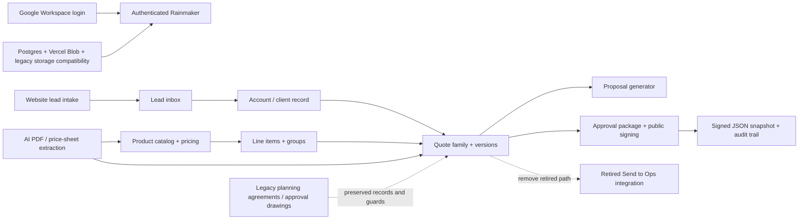

### Route and role map

| Route | Purpose | Role/entry | Primary data flow | Audit status |
|---|---|---|---|---|
| `/auth` | Google Workspace sign-in | Public | `/api/auth/google/status` -> Google OIDC | Keep; recent auth simplification is current |
| `/` | CRM dashboard | Authenticated | quotes + accounts + new leads, calculated in browser | Useful, but capped account total and metric semantics need repair |
| `/leads` | Website lead inbox | Authenticated | lead/account rows + status PATCH | Working and evidenced; conversion handoff incomplete |
| `/accounts` | Client list/create | Authenticated | paged accounts CRUD | Working; totals/search are page-local |
| `/accounts/:id` | Client history/detail | Authenticated | account details, contacts, quote families, legacy summaries | Core surface; terminology and quote handoff need improvement |
| `/quotes` | Quote list/import/proposal/delete | Authenticated | quote rows, PDF import, proposal generator | Core; role mismatch on delete and dense actions |
| `/quotes/new` | Create quote | Authenticated | account optional -> quote create | Working; client context is not carried from lead/account |
| `/quotes/:id/edit` | Quote builder | Authenticated | quote/version/lines/groups/pricing/signing + retired Ops control | Core but highest concentration of wiring and integrity risk |
| `/pipeline` | Board/list sales workflow | Authenticated | quotes -> stage PATCH; unused Rep control | Active; remove owner-confirmed unused Rep filter |
| `/products` | Catalog/pricing/import | Authenticated view; writes admin-gated | products/colors/pricing/AI/CSV | Large, evidenced catalog; validate actual use of each import/configurator path |
| `/admin` | Workspace users and storage | Admin | users + storage usage | Keep; narrow and understandable |
| `/admin/contracts` | Contract templates | Admin | contract template CRUD | Keep if used; linked `/admin/templates` is broken |
| `/sign/:token` | Customer proposal review/sign/download | Public bearer token | public DTO -> signature -> snapshot | Keep; public asset/group retrieval is broken |
| `/planning-agreements/sign/:token` | Legacy agreement signing | Public bearer token | preserved legacy record | Compatibility only; do not advertise as a new feature |
| `/contracts` | Compatibility redirect | Authenticated | -> `/admin/contracts` | Keep until inbound-link validation |
| `/admin/templates` | Stale admin link | Authenticated | no route | Broken; live 404 confirmed |

Source: `client/src/App.tsx:40-123`, `client/src/components/app-header.tsx:71-123`.

## Feature inventory

| Feature | Status | Evidence | Decision |
|---|---|---|---|
| Workspace-only human login | Working / evidenced | Current auth page/routes; workspace-only tests; recent commits | **Keep** |
| Website lead intake and attachments | Working with risk | 75 live lead rows; idempotency code; public attachment storage | **Improve** storage and inquiry model |
| Leads status inbox | Working / evidenced | Live status counts; local UI capture | **Keep and improve** conversion path |
| Accounts/clients | Working with reporting risk | 50-row cap; page-local search/totals | **Improve** server-backed totals/search |
| Dashboard | Useful but semantically misleading | Live data; client-side metrics over capped accounts | **Improve** metric definitions and provenance |
| Quote list and search | Working / evidenced | 276 live rows | **Keep** |
| Quote versions | Working / evidenced | 71 visible version labels; transactional copy/reset code | **Keep and harden** family invariants/audit |
| Quote editor | Core but risky | Real current UI; 2,313-line line-item component | **Improve** reliability and reduce burden |
| Catalog add | Partially implemented | selected product becomes unlinked custom line | **Finish** |
| Groups | Partially implemented | group CTA omits `groupId` | **Finish** |
| Sundance configurator | Unknown-needs-validation | mounted dedicated endpoint, no adoption telemetry | **Validate**, then keep if used |
| Dimensional pricing | Broken/risky | silent nearest-band fallback and non-transactional replacement | **Improve immediately** |
| PDF quote import | Discoverability/adoption concern + risk | visible live button; AI batch is non-transactional and selected customer can be ignored | **Validate and harden** |
| AI product import | Discoverability/adoption unknown | current UI/backend remains after chat removal | **Keep pending usage/cost evidence** |
| Proposal generator | Working but duplicative | separate from approval-package modal | **Consolidate** |
| Public proposal signing | Core, evidenced, partially broken | live signature states; token/snapshot path; visuals/groups inaccessible | **Keep and repair** |
| Contract templates | Partially wired | normal user picker calls admin-only GET | **Improve** role/read policy |
| Send to Ops / Ops Portal integration | Redundant/retired | portal retired; UI/API/integration remain | **Retire/remove** after dependency check |
| Reporting/analytics | Working as dashboard, no telemetry | client-side calculations and console request logs only | **Add** business events/read models |
| Notifications Bell | Owner-confirmed unused/dead | Bell has no action and was never used | **Retire/remove** |
| Dark mode | Partially implemented | toggle exists; many fixed light colors | **Validate**, then finish or remove |
| Planning agreements | Redundant/legacy | new creation returns 410; preserved records remain | **Label as legacy; preserve** |
| Order approval drawings | Redundant/legacy | new creation removed; legacy record/signing guards remain | **Label as legacy; preserve** |
| QuickBooks fields/settings | Legacy unknown | schema fields remain, no active frontend workflow found | **Validate before retirement** |
| Issue reports | Retired | current commit removed UI/routes; table intentionally preserved | **Do not re-recommend removal** |
| Replit/storage compatibility | Legacy unknown | lazy compatibility remains; prior cleanup was reversed/preserved | **Validate references before retirement** |

## End-to-end journey findings

### Step 1 — Sign in and recover from auth failure: **Needs improvement**

Workspace-only sign-in is the correct current direction. The app has a dedicated loading state and a connection-error state. However, the local failure test confirmed that clicking **Go to Login** changes the URL to `/auth` while the same error branch remains rendered, because the error return occurs before routing. The message also exposes raw parse text when `/api/user` returns HTML. Evidence: `client/src/App.tsx:44-80` and screenshot 01.

### Step 2 — Triage a website lead: **Generally healthy**

The lead inbox has clear counts, contact links, status actions, attachments, and a focused “before quote” explanation. It is one of the clearest surfaces. Gaps: “New Quote” does not carry the lead/client, account-detail “New Quote” routes to `/quotes` rather than `/quotes/new`, and no quote path visibly writes lead conversion metadata. Terminology shifts among lead/account/client/customer. Evidence: `client/src/pages/leads.tsx`, `client/src/pages/account-detail.tsx:522`, screenshot 03.

### Step 3 — Find or create a client: **Usable but misleading at scale**

Pagination is present, but search and filters apply only to the current 50-row page. “Total Clients” and “Active Projects” are current-page totals, while `projectCount` counts quote rows/versions rather than quote families. The live UI returned exactly 50 accounts and pagination controls. Evidence: `client/src/pages/accounts.tsx:36-121`, `server/routes/accountRoutes.ts:17-44`.

### Step 4 — Create or version a quote: **Strong model, weak failure handling**

Version creation is one of the stronger technical areas: content is copied and signatures reset. Archived versions are visually marked and restricted. But a failed/404/403 quote fetch is ignored and a complete blank quote model is rendered instead, creating a phantom editor. Making an old version current has no durable audit event; the Version History path warns about signature activity, while the direct archived-version banner action lacks that warning. Evidence: `client/src/pages/quote-builder.tsx:51-58,287-407,445-466,510-560`, `server/storage.ts:1514-1747`.

### Step 5 — Build line items and pricing: **High friction and partially broken**

The editor offers strong cost/markup/tax/tariff explanations, autosave, catalog selection, custom items, a Sundance builder, groups, bulk margin, and keyboard-friendly field editing. It is also extremely dense and carries eleven columns.

Two deterministic wiring failures materially undermine trust:

- “Add From Catalog” copies display values but the create payload omits `productId`, SKU, manufacturer, dimensions, and configuration. Evidence: `client/src/components/line-items-table.tsx:1196-1278`.
- “Add Item to Group” only opens the global form and the create payload omits `groupId`, so the item lands ungrouped. Evidence: `client/src/components/line-items-table.tsx:1233-1244,2073-2078`.

Unsupported configurable dimensions silently receive the nearest pricing band with no distance threshold. Evidence: `server/storage.ts:2281-2329`, `server/routes/productRoutes.ts:438-465`.

### Step 6 — Generate a proposal and prepare approval: **Duplicated and customer output is incomplete**

The app has two overlapping package experiences: Proposal Generator and Proposal Approval Options. Both control pricing, contract terms, visuals, and document output with different presentation/defaults. This increases uncertainty over which artifact is authoritative.

More seriously, the public DTO does not include renderings or groups. The public screen then calls authenticated endpoints for those assets and silently continues after failure. “Include Visuals” can therefore produce a customer preview/PDF without the included visuals, and grouped pricing can lose group headings/aggregation. Evidence: `server/quotePublicSigning.ts:91-142`, `client/src/pages/public-sign.tsx:409-427,482-505`, `server/routes/quoteRoutes.ts:2280-2300`, `server/routes/lineItemRoutes.ts:413-430`.

Current PDF professionalism remains **unvalidated** in this audit. No customer PDF was generated from live data or signed during the read-only run. The code confirms multiple renderers and package-fidelity risks, but a visual judgment about the current proposal/contract/approval exhibit requires a safe test quote and rendered-PDF comparison.

### Step 7 — Sign and lock the customer-approved scope: **Snapshot exists; business lock does not**

The public flow has a clear review/sign/receipt structure, consent language, a strong bearer token, audit entries, and a frozen JSON snapshot. That is worth keeping. But staff can still update the quote and line items after signing. Even with the retired Ops integration removed, Rainmaker can display a live quote that no longer matches the customer-approved snapshot. Signed versions should be immutable; changes should create a new version. Evidence: `server/routes/quoteRoutes.ts:1195-1236,2073-2133`, `server/routes/lineItemRoutes.ts:162-386`.

### Step 8 — Retired Send to Ops path: **Remove**

The Ops Portal has been retired, so this is no longer a readiness/idempotency problem to solve. Remove the **Send to Ops** button, Ops workflow badge, confirmation dialog, API route, integration modules, environment settings, and Ops-specific documents/tests/docs after a focused reference check. Do not invest in hardening or expanding this path. The separate workflow bug—marking **Signature** complete when either the customer or EDG has signed—still needs correction. Evidence: `client/src/components/quote-header.tsx:423-464,520-564`, `server/routes/quoteRoutes.ts:1317-1348`, `server/integrations/operations.ts:83-178`.

## UI and UX findings

### Strengths

- The visual system is substantially more coherent than the underlying architecture: consistent card, table, badge, form, and dialog patterns.
- The dashboard is scannable and translates quote data into business language.
- Lead triage is focused and action-oriented.
- Quote pricing exposes cost, markup, customer unit, margin dollars, tax, tariff, and totals with inline explanations.
- Archived quote versions and approval status are visible.
- Public signing uses a clear multi-step journey with consent and completion feedback.
- Most top-level destructive actions use confirmation dialogs.
- Loading bars, skeletons, mutation states, and toasts are common.

### High-impact UX problems

1. **Mobile loses navigation entirely.** Desktop nav is `hidden md:flex` with no mobile replacement. Screenshot 11 confirms only the logo/theme affordance remains at 390px. Evidence: `client/src/components/app-header.tsx:71-123`.
2. **The quote editor is one very long page.** Details, address, versions, line items, contract, totals, signing, BOM, proposal, and a retired Ops control all compete. The workflow indicator does not function as navigation.
3. **Role-ineligible controls remain visible.** All users see quote/account deletes, while APIs require admin. All users see a contract-template picker, while the read endpoint requires admin. Evidence: `client/src/pages/quotes.tsx:445-478`, `client/src/pages/accounts.tsx:330-367`, `server/routes/quoteRoutes.ts:1351`, `server/routes/accountRoutes.ts:166`, `client/src/components/quote-summary.tsx:98-101`, `server/routes.ts:598-609`.
4. **Errors are often rendered as empty data.** Quote, account, product, and pipeline query failures are not consistently surfaced. QuoteBuilder is the most dangerous example.
5. **Destructive patterns are inconsistent.** Quotes/accounts confirm deletion; line items, groups, and some proposal images delete immediately without undo.
6. **Terminology is unstable.** Account/client/customer and proposal/approval/signature/contract overlap.
7. **Dead affordances reduce trust.** Bell has no action; Rep filter does nothing; Templates link is a live 404. EDG confirms these visible controls were not used and may be removed.
8. **Dark mode is not system-wide.** Fixed `bg-white`, `bg-gray-*`, `text-gray-*`, and hard-coded dark logo fills bypass tokens.
9. **The 404 is developer-facing.** Live `/admin/templates` showed “Did you forget to add the page to the router?” with no return action.
10. **Dashboard time and profit labels overstate precision.** “Won/Profit This Month” uses a quote's generic `updatedAt`, so editing an older won quote can make it appear newly won this month. “Profit” is summed markup, not net profit. Evidence: `client/src/pages/home.tsx:57-68,76-82,96-111`.
11. **Optional client conflicts with downstream approval.** The quote workflow encourages client/account omission and marks Details complete from project name alone, but approval email later requires an account email. Evidence: `client/src/components/quote-header.tsx:436-445,624-653`, `client/src/components/quote-summary.tsx:1005-1010`.
12. **Some “edit” language is not editable.** Quote Importer calls the step “Preview & Edit,” but extracted line items are rendered read-only. Evidence: `client/src/components/quote-importer.tsx:949-976`.
13. **Grouped line-item alignment is likely fragile.** Group header/footer rows use `colSpan={9}` against an eleven-column table. Evidence: `client/src/components/group-components.tsx:68-69,149-152`.

### Screenshots captured in this audit

#### Local auth failure and failed recovery

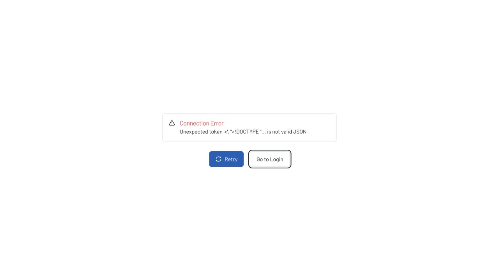

#### Dashboard, current UI with fictional fixture data

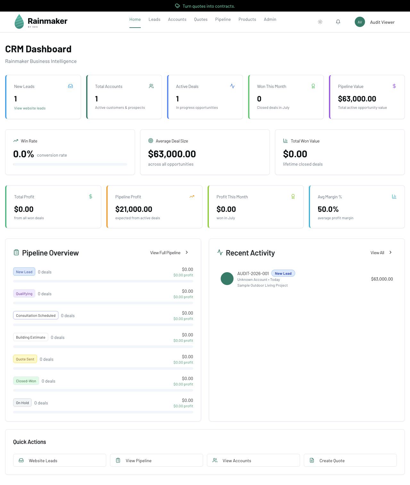

#### Website lead inbox, current UI with fictional fixture data

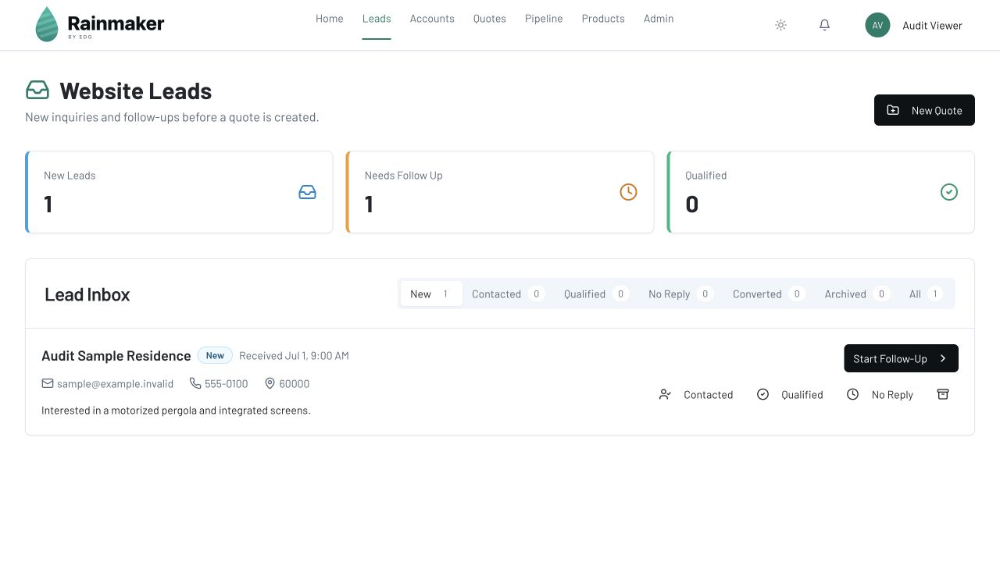

#### Quote list and signature states, current UI with fictional fixture data

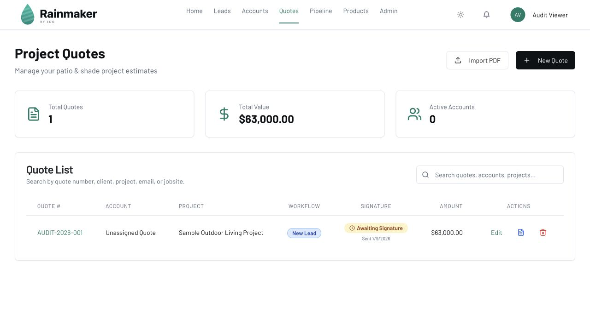

#### Pipeline board and visible Rep filter

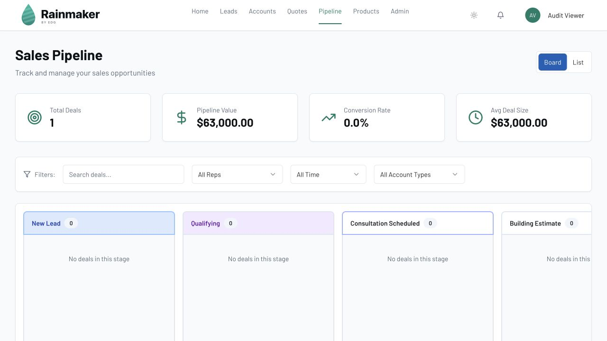

#### Full quote editor, current UI with fictional fixture data

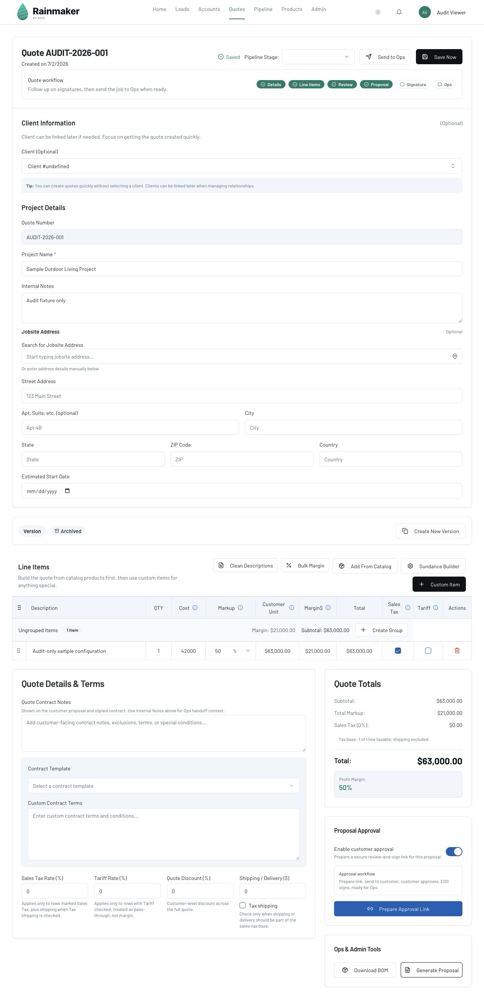

Fixture note: the sample omitted some server-derived relationship/version fields, so `Client #undefined` and the sample Archived badge are fixture artifacts, not production findings.

#### Product catalog and import tools

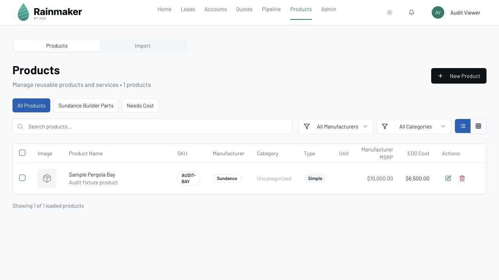

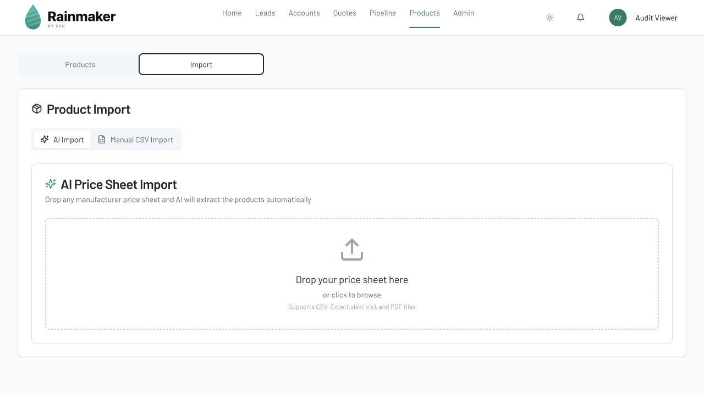

#### Administration and contract-template surfaces

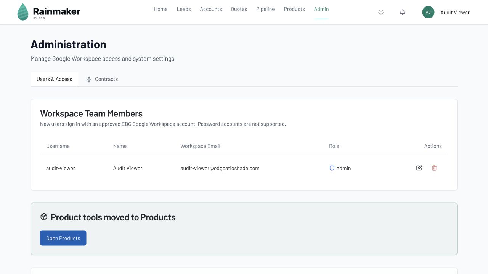

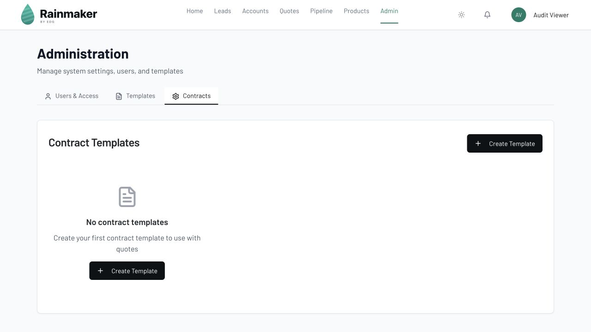

#### Mobile lead surface without navigation

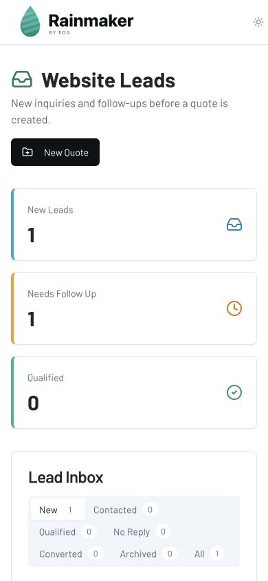

#### Live production stale Templates route

## Accessibility findings

### Confirmed strengths

- Radix primitives provide a solid semantic base for dialogs, tabs, selects, and focus management.
- Most form inputs have labels and validation text.
- Public-sign consent and tax/tariff checkboxes have explicit accessible names.
- Pipeline includes a keyboard drag sensor.
- Line-item fields support Enter/Escape/Tab editing.

### Confirmed or likely risks

- No mobile navigation means small-screen and zoomed users cannot reach core routes.
- Line-item drag/drop uses pointer input only; keyboard users cannot reorder line items/groups.
- Catalog/PDF-import choices include clickable `div` cards rather than keyboard controls.
- Several icon-only destructive controls lack accessible names.
- Product filter removal uses clickable SVG rather than a button.
- Dense quote tables depend on horizontal scrolling and hidden columns at breakpoints.
- Focus order and error announcements for the long quote page have no automated coverage.
- Dark mode/contrast and 200% zoom reflow were not comprehensively tested.

This audit does not claim WCAG compliance. A keyboard-only run, screen-reader labels/landmarks check, automated axe pass, 200% zoom test, and high-contrast review are still required.

## Product and workflow findings

### 1. Lead and customer identity are incorrectly combined

Website intake matches only lowercase email and overwrites the existing account with the new lead payload, including identity, phone, type, address, status `new`, source, and message. A returning customer can lose curated profile/status data. Evidence: `server/routes/leadIntakeRoutes.ts:194-239`.

**Decision:** Add an append-only inquiry/submission entity linked to an account. Until then, merge conservatively and never regress an established status automatically.

### 2. “Converted” is not a real handoff

Live lead status showed zero converted records while quotes and closed-won records exist. This is not proof that staff never converts leads; it is evidence that conversion truth is not reliably tied to quote creation. A prefilled quote action should set explicit conversion metadata and retain the source inquiry.

### 3. Quote family is the right strategic unit

Versioning exists and is visibly used. Recommendations should reinforce one quote family with current/archived options rather than separate duplicate quote records. Add invariants: exactly one current version per family, signed versions immutable, and auditable “make current” decisions.

### 4. Proposal packaging is duplicated

Proposal Generator and Approval Options should become one package builder with one authoritative preview, one set of include/exclude choices, one signed snapshot, and one post-sign download implementation.

### 5. Ops integration is retired

The Ops Portal is no longer an EDG system of record. Remove the active-looking handoff path from Rainmaker and do not add new Ops tracking, idempotency, permissions, or document logic. The replacement post-sale destination, if any, is outside this audit and should not be inferred.

### 6. Legacy planning/drawing features need an explicit support mode

New planning agreement and approval-drawing creation is intentionally retired (`410`). Existing records still block or inform old quotes, but their action panels are unmounted. The generic planning-agreement PATCH can still set arbitrary statuses outside the guarded transition endpoints, and “apply credit” records agreement metadata without changing quote pricing. Label these paths “legacy record support,” provide a narrow admin resolution path for stranded records, close the transition bypass, and do not revive the old plans without a fresh product decision.

### 7. PDF import can ignore the customer the user selected

The import flow passes `existingCustomerId`, but `handleCustomerAttachment` does not use it. Extracted-data matching or account creation can win instead of the explicit UI choice. The batch path is also non-transactional, so a failed document can leave a partial account/quote/line set. Evidence: `server/routes/quoteRoutes.ts:305-443,948-952,1043-1175`.

## Technical and data-risk findings that materially affect users

| Priority | Finding | User consequence | Evidence |
|---|---|---|---|
| Critical | Signed versions remain mutable | The live quote can diverge from the customer-approved snapshot, creating conflicting commercial truth | `quoteRoutes.ts:1195-1236,2073-2133`; `lineItemRoutes.ts:162-386` |
| Critical | Vision cache uses only first 100 base64 chars per page | Within the same warm instance and six-hour image-extraction cache window, different image documents can plausibly share extracted customer/pricing data; text-extracted PDFs are not affected | `server/openai.ts:98-100,1091-1100,1224-1226` |
| Retire | Retired Ops document code also has incorrect `fixed`/`dollar` math | Confirms this path should be removed, not repaired for continued use | `operationsDocuments.ts:74-90`; `validation-schemas.ts:554-570` |
| High | Public signing calls authenticated rendering/group APIs | Customer documents silently omit intended visuals/group metadata | `public-sign.tsx:409-427,487-495`; guarded routes above |
| High | Nearest pricing band has no tolerance | Unsupported dimensions receive a plausible wrong price | `storage.ts:2281-2329` |
| High | Pricing-table replacement is delete-then-loop without transaction | Failed import can leave partial/empty pricing | `productRoutes.ts:490-553` |
| High | Audit baseline gave all staff several high-consequence workflow actions | Finance, signature, and version authority was too broad | Current local-only status: retired planning/finance mutation is admin-only and the false ownership check is removed; salesperson signature-email and version-override authority still require an owner decision. See [Phase 5A](./phase5-permissions-baseline-2026-07-10.md). |
| Retire | Send-to-Ops UI/API/integration remains after the portal was retired | Dead workflow can mislead staff and expand maintenance/security surface | `quote-header.tsx:423-464,520-564`; `quoteRoutes.ts:1317-1348`; `server/integrations/operations.ts` |
| High | Lead intake overwrites account identity/status | Returning inquiry can regress or replace curated customer data | `leadIntakeRoutes.ts:194-239` |
| High | Lead photos use public Blob URLs | Private customer-space photos may be publicly reachable by URL | `leadIntakeRoutes.ts:386-412`; `objectStorage.ts:521-538` |
| High | AI/PDF import can ignore selected customer and is non-transactional | Explicit user choice can be overridden; failed imports can leave partial records | `quoteRoutes.ts:305-443,948-952,1043-1175` |
| Medium-high | Image deletion is metadata-only; quote deletion removes quote/lines but leaves groups, image metadata, and Blob bytes | Blob/orphan retention and inconsistent cleanup; live orphan count is unknown | `storage.ts:955-962,2536-2564`; `shared/schema.ts:350-382` |
| High | `/health` bypasses app/DB/session startup | Deploy can appear healthy while the app is broken | `vercelHandler.ts:42-56` |
| Medium-high | Request-time reads run schema DDL | Latency, locks, permissions, and hidden migration drift | Audit baseline: `server/db.ts:30-145`; `storage.ts:492-500`. Addressed in the current local-only implementation by [Phase 5B](./phase5-schema-readiness-2026-07-10.md); production readiness remains unverified. |
| Medium-high | Signing writes are check-then-update, not atomic | Concurrent submissions can race | `quoteRoutes.ts:2073-2133` |
| Medium-high | Email sends precede audit persistence | Customer may receive a link while Rainmaker reports failure | `quoteRoutes.ts:1837-1859` |
| Medium-high | Logs include raw request bodies | Customer, notes, and pricing data may enter console logs | `quoteRoutes.ts:1205`; account/import route logging |
| Medium | Signed PDF bytes are regenerated client-side, not stored | Legal/artifact fidelity expectations may not match implementation | snapshot/PDF generation path |
| Medium-high | Generic legacy planning PATCH bypasses guarded transitions; credit is tracking-only | Preserved records can enter misleading statuses, and “credited” does not change quote totals | `validation-schemas.ts:424-432`; `planningAgreementRoutes.ts:320-345,941-973`; `operations.test.ts:35-72` |
| Medium | Public signing tokens have no automatic expiry/dedicated revocation timestamp | Bearer links remain usable unless e-signature is disabled or the version is archived | signing-token route/model |
| Medium | Serverless rate limits/caches are instance-local | Protection and cache behavior vary by warm instance | quote/OpenAI module state |
| Medium | Large PDF/font bundles | Slow first use on quote/signing/import surfaces | build: 1.9 MB worker, 667 KB font chunk, 412 KB PDF chunk |

## Test, observability, and maintainability findings

- At audit time, `npm test` passed 96 tests while 25 database-backed quote-storage tests were skipped. Phase 0 subsequently added an isolated PGlite socket harness; all 25 now pass locally and CI runs them separately after the ordinary suite.
- No client unit tests, seeded browser journey tests, PDF visual regression tests, automated accessibility tests, or full OAuth/email/OpenAI integration tests were found. Ops-specific code/tests should be retired with the obsolete integration rather than expanded.
- Security/source-policy tests provide value but several assert source strings rather than real request behavior.
- No PostHog, Segment, Mixpanel, Sentry, GA event layer, or equivalent was found. Request logging is console-only.
- The error boundary says the team has been notified, while production error reporting is a commented placeholder (`client/src/components/error-boundary.tsx:33-40`).
- Complexity is concentrated: `quoteRoutes.ts` 2,582 lines, `storage.ts` 2,571, `line-items-table.tsx` 2,313, `products.tsx` 1,519, `openai.ts` 1,418, `quote-summary.tsx` 1,133.
- Current source registers 172 Express route declarations. Route volume plus broad authenticated permissions increases review burden.
- Docs drift: May database inventory omits newer tables; the 2025 calculation report references removed utilities; June drawing plans are no longer active product direction; cleanup tracker mixes intermediate/final state; lead-intake docs omit current idempotency behavior.

### Verification completed in this audit

- `npm test -- --reporter=dot`: **96 passed, 25 skipped at audit time**. Phase 0 follow-up: **25/25 database tests pass** through `npm run test:database:isolated`.
- `npm run check`: passed.
- `npm run build`: passed; bundle-size warnings recorded.
- `npm run assets:audit`: 3 tracked referenced assets, 0 unreferenced, no private-key files.
- `npm run secrets:audit`: 249 files scanned, no findings.
- Local current-source UI rendered through a fictional-data audit harness.
- Live production read-only route/aggregate inspection completed for dashboard, leads, accounts, quotes, pipeline, products, and `/admin/templates`.

## Ranked recommendations

| Rank | Recommendation | Impact | Confidence | Effort | Change risk |
|---:|---|---|---|---|---|
| 1 | Remove the retired Send-to-Ops UI/workflow now; remove its backend/config/docs/tests after a focused dependency check | Very high | High | Medium | Medium |
| 2 | Make signed scope immutable; require a new version for every post-sign edit | Very high | High | Medium | Medium |
| 3 | Fix public signing DTO/package so renderings and groups are token-scoped and snapshot-backed | Very high | High | Medium | Medium |
| 4 | Replace vision cache key with full-byte cryptographic hash or disable cache | Very high | High | Small | Low |
| 5 | Preserve product/group identity in line-item creation | High | High | Medium | Medium |
| 6 | Reject unsupported dimensions; transactionally validate/replace non-overlapping pricing bands | High | High | Medium | Medium |
| 7 | Make PDF import transactional and honor the customer explicitly selected in the UI | High | High | Medium | Medium |
| 8 | Separate inquiries from accounts; stop overwriting customer identity/status | High | High | Medium-large | Medium-high |
| 9 | Make lead photos private and inventory Blob/orphan references before cleanup | High | High | Medium | Medium-high |
| 10 | Add explicit 403/404/retry states; never render blank quote on load failure | High | High | Small-medium | Low |
| 11 | Align frontend visibility with roles and add manager/finance capabilities | High | High | Medium | Medium |
| 12 | Fix server-backed account search/counts and count quote families, not versions | High | High | Medium | Low-medium |
| 13 | Add lead/client-prefilled quote creation and explicit conversion event | High | Medium-high | Medium | Low-medium |
| 14 | Add mobile navigation; remove owner-confirmed unused Bell/Rep filter/Templates link | Medium-high | High | Small-medium | Low |
| 15 | Consolidate proposal generator and approval-package configuration | High | Medium-high | Medium | Medium |
| 16 | Add frontend/E2E/PDF/a11y tests plus structured events and real readiness | High | High | Medium-large | Low-medium |
| 17 | Move request-time schema DDL into deployment migrations | High | High | Medium | Medium-high |
| 18 | Inventory and label legacy planning/drawing/QuickBooks/storage paths before retirement | Medium | High | Medium | Low for audit; high for deletion |

## Quick wins, medium-term improvements, and strategic bets

### Quick wins (days)

- Full-byte hash for vision cache.
- Remove the retired Send-to-Ops button, workflow step, and confirmation dialog.
- Pass `productId` and `groupId` through line-item creation.
- Remove arbitrary `status` from the generic legacy planning-agreement PATCH and label credit as tracking-only.
- Add QuoteBuilder error state.
- Hide role-ineligible delete controls; decide whether contract-template read should be staff-wide.
- Remove Rep filter, Bell, and Templates link; EDG has confirmed they were not used.
- Fix auth-error message/recovery and customer-friendly 404.
- Add mobile navigation.
- Require confirmation/undo for line/group/image deletion.

### Medium-term (2–6 weeks)

- Immutable signed versions and signed-vs-current diff gate.
- Token-scoped public package containing renderings, groups, and exact signed snapshot.
- Remove retired Ops route/integration/configuration/documents/tests/docs after a dependency/reference check.
- Validated transactional dimensional pricing bands.
- Server-backed client search/counts and quote-family counts.
- Lead-to-prefilled-quote conversion path.
- Transactional PDF import that honors the explicitly selected customer.
- Private attachment delivery and orphan/reference inventory.
- Consolidated proposal/approval package builder.
- Page-level error handling, dark-mode decision, and accessibility remediation.

### Strategic bets (after evidence)

- Append-only inquiry model separate from customer/account identity.
- Capability-based permissions and approval gates.
- Durable outbox for customer email operations.
- Product analytics/business-event layer designed around quote-family lifecycle.
- Modularize quote, pricing, and document domains after behavior is protected by tests.

## Keep / improve / consolidate / finish / retire / add

### Keep

- Google Workspace-only human authentication.
- Quote-family/version concept and archived-version protections.
- Public signing journey, audit trail, and explicit package toggles.
- Lead inbox, product catalog, Sundance pricing default, tax/tariff explanations.
- Preservation-first storage and legacy-record policy.

### Improve

- Signed-scope immutability and customer-document fidelity.
- Lead/account identity handling.
- Pricing validation and adjustment parity.
- Error states, mobile navigation, destructive recovery, account reporting.
- Public asset privacy and operational observability.

### Consolidate

- Proposal Generator + Approval Options + post-sign download into one package model.
- Account/client/customer terminology.
- Approval/signature/contract wording.
- Duplicate unused auth and combobox components after reference checks.

### Finish

- Product-linked catalog insertion.
- Group-targeted insertion.
- Contract-template role policy.

### Retire from visible UI

- Entire Send-to-Ops workflow and retired Ops Portal integration.
- Bell.
- Rep filter and Rep assignment affordances.
- Stale Templates link.
- Developer-facing 404 copy.
- Dark-mode toggle if a complete theme pass is not funded.

### Add

- Prefilled lead/account -> quote action and explicit conversion event.
- Signed-vs-current diff and forced new-version workflow.
- Page-level retry/empty/error differentiation.
- Mobile route navigation.
- Capability-based release/finance permissions.
- Durable business events and a real readiness endpoint.

### Preserve pending validation

- Legacy planning agreements and approval drawings.
- Public legacy signing routes.
- QuickBooks fields/settings.
- Replit/storage locators and compatibility aliases.
- Historical image/blob references and preserved tables.

## Phased improvement roadmap

### Phase 0 — Evidence and safety gate

Done when there is a read-only database/storage inventory, signed-vs-current diff report, role roster, retired-Ops dependency/reference check, and backup/reference proof. No customer/project data or storage compatibility deletion in this phase.

### Phase 1 — Quote integrity hotfixes

Remove retired Ops and owner-confirmed unused visible controls. Fix cache collision, product/group linking, quote-load errors, public rendering/group delivery, and pricing out-of-range behavior. Add focused regression tests.

### Phase 2 — Signed scope and document authority

Lock signed versions, force new versions for changes, make the signed artifact authoritative, and expose a clear signed-vs-current/new-version workflow.

### Phase 3 — Adoption and UX repair

Prefill lead/account quote creation, add conversion events, repair account totals/search, add mobile navigation, align roles, consolidate proposal/approval, and standardize terminology.

### Phase 4 — Data model and observability

Separate inquiries from accounts, add email outbox events, structured request/business logging, true readiness, private attachments, and orphan/reference reporting.

### Phase 5 — Simplification

Only after usage/reference evidence: retire approved legacy code/data paths beyond the already-approved visible removals; decompose the largest modules behind stable tests.

## Validation gaps and exact evidence needed

1. **Signed drift:** count signed quotes whose current account/scope/line items/totals differ from `signedDocumentSnapshot`; list only IDs internally, not customer data.
2. **Quote-family integrity:** families with zero or multiple `isLatestVersion=true`, version gaps, and signatures on non-current versions.
3. **Public package:** one safe test quote with groups, visuals, contract, pricing, and optional drawing; compare pre-sign preview, signed snapshot, and receipt PDF.
4. **Catalog linking:** create simple and configurable catalog lines and verify product ID, SKU, manufacturer, config, group, and price source.
5. **Pricing quality:** overlaps, gaps, inverted ranges, duplicate bands, negative base prices, and quotes priced outside ranges.
6. **Retired Ops dependency check:** confirm there is no remaining consumer, required audit record, pending job dependency, or replacement-system contract before backend/configuration deletion.
7. **Roles:** production roster and business-approved capability matrix for sales, manager, finance, and admin.
8. **Lead identity:** repeated-email submissions, overwritten fields/statuses, inquiry frequency, and desired conversion semantics.
9. **Storage:** DB locator counts by provider, Blob object inventory, public lead attachment URLs, orphans, deleted-record references, and verified backup/checksums.
10. **Legacy records:** counts/recency/statuses for planning agreements, approval drawings, QuickBooks fields/settings, issue reports, and legacy signing links.
11. **Actual feature adoption:** after an approved deployment, observe the new post-instrumentation package preparation, quote/PDF import, signature, email-acceptance, version, lead-conversion, and dimensional-pricing events for a defined period. Add appropriately minimized evidence for AI/CSV product import, Sundance Builder, client-only BOM/preview/download actions, and contract templates only if those decisions still require it. Never infer historical non-use from a zero.
12. **Documents:** visual review of actual customer PDF/proposal/contract/approval exhibit at desktop and print sizes, including missing-brand-asset behavior.
13. **Accessibility:** keyboard-only pass, axe scan, screen-reader landmarks/names, 200% zoom, 390/768/1024 breakpoints, contrast, focus, and error announcements.
14. **Performance:** cold-load timings for quote builder, product import, and public signing on typical office/mobile connections.
15. **Production proof:** exact deployed commit, Vercel Ready state, real readiness (not liveness only), `/api/user`, and browser verification after any future implementation.

## Final decision

Rainmaker should remain EDG's pre-sale source of truth. The Ops Portal is retired, and this audit does not assume a replacement post-sale system. The immediate product objective is not to add more surface area. It is to make one quote family move safely and unambiguously from lead -> priced scope -> customer-approved snapshot, while removing every retired or owner-confirmed unused control that implies a capability EDG does not actually use.
