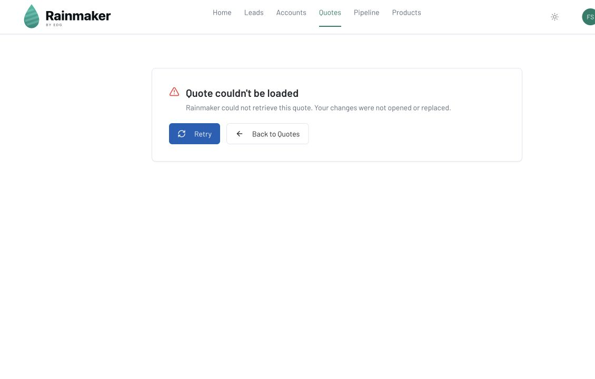

# Phase 1C safety fixes — 2026-07-10

**State:** complete locally; not committed, pushed, deployed, or production-verified.

This package resolves four high-confidence failure modes identified by the audit without changing production data, deleting legacy records, sending customer actions, or removing compatibility routes.

## Complete-image vision cache identity

The image extraction cache previously hashed only the first 100 base64 characters of each page. Different page images with the same prefix could therefore reuse the wrong AI extraction.

- `server/openai.ts:97-116` now hashes every decoded image byte, page index, and byte length with a versioned SHA-256 identity.
- `server/openai.ts:1103-1109` uses that identity for vision extraction cache access.
- `server/tests/openai.test.ts` proves that images sharing the old 100-character prefix but differing in their bodies produce different cache keys, and that page identity is included.

No AI request or production document was submitted during verification.

## Guarded legacy planning transitions

New Design + Planning Agreement creation remains retired, while existing records and dedicated transition routes remain available for compatibility.

- `server/validation-schemas.ts:424-431` removes `status` from the generic PATCH schema and rejects unknown transition fields.
- `server/routes/planningAgreementRoutes.ts:320-342` continues to allow ordinary metadata edits only after strict validation.
- Payment, signature, delivery, waiver, and credit changes still use their dedicated guarded routes and preserve their existing audit events.
- A route regression test proves that direct `{ status: "credited" }` mutation returns HTTP 400 and never reaches storage.

The legacy credit dialog now calls the action **Record Credit** and explains the actual behavior: it is a separate amount-due adjustment, leaves taxable line items/tax/discount/displayed quote Total unchanged, and can appear separately in customer documents. This is clarification only; stored legacy credit data and customer-document compatibility were not changed.

## Authentication recovery

- `client/src/hooks/useAuth.tsx:12-26` converts HTML, JSON parser details, excessive strings, and non-string failures to a safe connection message.
- `client/src/hooks/useAuth.tsx:114-121` exposes an in-place retry and a deliberate error dismissal.
- `client/src/App.tsx:40-79` uses those actions: **Retry** re-runs the auth check without reloading the whole application, while **Go to Login** exits the blocking error branch before routing.

The synthetic one-time-failure fixture proved that Retry reaches the authenticated dashboard. The persistent-error fixture proved that Go to Login reaches `/auth` instead of leaving the Connection Error screen mounted.

## Explicit quote-load failures

Previously, an edit-route fetch failure fell through to the new-quote fallback object and could display a phantom blank editor.

- `client/src/pages/quote-builder.tsx:51-58` retains the explicit query state and recovery function.
- `client/src/pages/quote-builder.tsx:286-329` stops before creating an editable fallback and renders distinct 403, 404, and retryable failure states.
- 403 and 404 provide a safe return to Quotes. Transient failures provide Retry and a return action.
- The messages explicitly state that the quote was not opened or replaced.

In-app Browser evidence using only fictional local data:

| Fixture | Observed result |
|---|---|
| `quote-403` | “You don't have access to this quote”; no editor; Back to Quotes |
| `quote-404` | “Quote not found”; no editor; Back to Quotes |
| `quote-error` | “Quote couldn't be loaded”; Retry and Back to Quotes |
| `auth-recover` | One-time auth failure; Retry reached the dashboard |
| `auth-error` | Go to Login reached `/auth` |

## Verification

- `npm test -- --reporter=dot`: 15 files passed, 1 skipped; 102 tests passed and 25 database tests intentionally skipped in the ordinary suite.
- `npm run test:database:isolated`: 25 passed against a fresh disposable PGlite restore.
- `npm run check`: passed.
- `npm run build`: passed.
- `git diff --check`: passed.
- `npm run assets:audit`: passed; three tracked assets, none missing or unreferenced.
- `npm run secrets:audit`: passed; 249 files scanned with no findings.
- React best-practices review found no blocking hook, accessibility, component-structure, or TypeScript issue in the changed UI paths.

The optional full Git-history private-key scan could not start because a pre-existing local remote-tracking ref (`refs/remotes/origin/codex/approval-drawing-release`) points to a missing Git object. The ref was not altered. This does not change the passing current-worktree secret scan, but the repository-history scan should be rerun after that local Git metadata is repaired.

## Remaining gates

- Phase 1B Ops backend/configuration retirement remains blocked on the read-only production preservation inventory and consumer/reference evidence.
- Phase 2 signed-version locking and snapshot/package work must not begin as a production migration until signed-snapshot mismatch counts are known.
- Everything in this report is local-only. Deployment and production verification require separate explicit approval.
