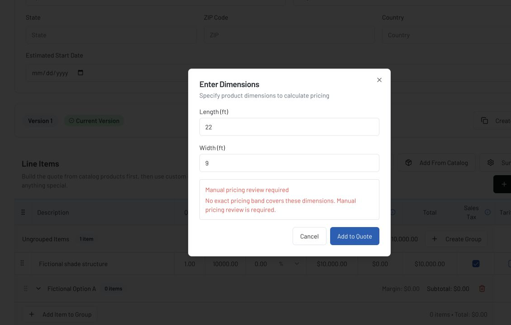

# Phase 3B dimensional-pricing safety — local implementation evidence

**Date:** 2026-07-10
**State:** implemented and verified locally; not committed, pushed, deployed, or run against production data.

## Outcome

Dimensional pricing now returns a price only when exactly one configured band covers the requested dimensions. It no longer guesses from the nearest band. Missing coverage, ambiguous coverage, and an unconfigured table produce stable errors that require manual pricing review.

Pricing-table creation, editing, and bulk replacement validate the complete product table. Bulk replacement validates before deleting and performs the delete/insert inside one transaction, so a failed upload leaves the prior table intact. Recalculation cannot create a negative EDG cost.

## Exact-match policy

`server/pricingBands.ts` is the shared policy boundary:

- dimensions are converted to canonical inches from an explicit `feet`, `inches`, or `meters` source unit;
- every range must contain finite non-negative dimensions, `min < max`, and non-negative retail/base prices;
- two rectangles may not overlap or share an inclusive boundary;
- zero matches return `PRICING_MANUAL_REVIEW` with HTTP 422;
- no configured rows return `PRICING_NOT_CONFIGURED` with HTTP 404; and
- multiple matches or an invalid table fail closed instead of selecting a plausible price.

No tolerance or nearest-band fallback is enabled. This implements the conservative decision in the improvement plan: unsupported dimensions require a human price check.

## Units and table administration

Pricing-table rows are stored in inches. The quote dimension dialog and the dimensional-pricing manager explicitly submit `sourceUnit: "feet"`; API routes convert values to inches before storage or lookup. The manager converts stored inches back to feet for display and editing.

Create and update operations lock the owning product and validate the candidate full table before writing. Bulk upload uses `replacePricingTablesForProduct`, which locks the product, validates all rows, and replaces them in one transaction.

The existing `deletePricingTablesByProductId` compatibility method remains available, but the active bulk upload path no longer calls it. No production rows were transformed or backfilled.

## Legacy product compatibility discovered during verification

The isolated restored database exposed that the historical `products.default_unit_price` column is still non-null even though current Rainmaker uses `retail_price` and `cost_price`. New product creation could therefore fail on a fully restored database.

The compatibility column is now mapped and synchronized to `retailPrice` on current catalog writes. Migration `0026_preserve_legacy_product_price_default.sql` adds a non-destructive zero default for older/direct writers. Private-preview migration against a child of the real production schema then showed that production no longer had this compatibility column at all. The migration now safely recreates it when absent, backfills existing rows from `retail_price`, and restores its default and non-null boundary. A focused PGlite test reproduces that production-drifted shape. The legacy column is retained; no compatibility data is removed.

## User-facing recovery

The configurable-product dialog keeps the entered dimensions open after a pricing failure and renders a persistent inline alert:

> Manual pricing review required
> No exact pricing band covers these dimensions. Manual pricing review is required.

The existing destructive toast remains as secondary feedback. The persistent alert was added after browser verification showed that a transient notification alone was not reliably visible in the active modal.

## Verification

| Check | Result |
|---|---|
| TypeScript | Pass |
| Ordinary tests | 135 passed; 38 database tests intentionally skipped without the isolated harness |
| Isolated fresh-database tests | 38 passed |
| Production build | Pass; existing large-chunk warning remains |
| Pure pricing policy tests | Pass: unit normalization, invalid ranges, overlaps/shared boundaries, exact match, gap |
| Route tests | Pass: feet-to-inches conversion and stable 422/409 responses |
| Database rollback test | Pass: an ambiguous replacement preserves the previous pricing table |
| Recalculation test | Pass: dollar discount cannot make EDG cost negative |
| Migration restore | Pass: legacy product price has a default and current schema is present |
| In-app Browser | Pass: fictional 22 ft × 9 ft request remains open with persistent manual-review alert |

The browser fixture used only fictional records and returned a deterministic 422 response. It did not create a quote line or modify any local or production business record.

## Remaining boundary

- Existing production pricing rows have not been classified as inches versus legacy feet. Before any production rollout or transformation, obtain a read-only distribution of min/max values by product and compare representative rows with their source price sheets.
- Existing production tables have not been checked for overlaps, shared inclusive boundaries, gaps, inverted ranges, or negative prices. The exact evidence needed is a read-only validation report containing product IDs and issue counts, not customer content.
- Gaps created intentionally between decimal ranges now require manual review. If EDG wants a tolerance, it must be defined explicitly in inches and covered by boundary tests; it must not revive nearest-band guessing.
- Product imports and quote/PDF imports still need their own transactional and price-semantics work in Phase 3C.

No production behavior or data changed during this work.
