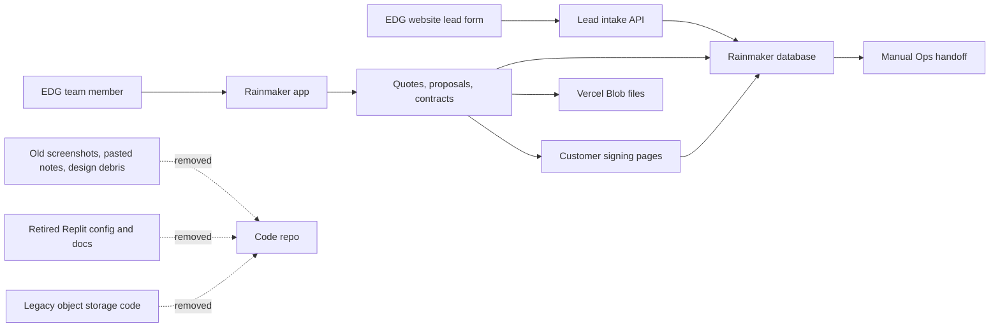

# Rainmaker Repo Cleanup Map

Date: 2026-06-17

This repo is the Rainmaker app: leads, quotes, proposals, contracts, signatures, and the pre-Ops handoff. The active production path is GitHub plus Vercel plus Vercel Blob. Replit is retired and should not appear as the normal run, deploy, or storage path.

## Cleaned Up

- Removed retired Replit project files and Replit-specific deploy notes.
- Removed Replit-only Vite development plugins and the Replit browser banner.
- Renamed the old auth module to `auth` so the filename matches today's app.
- Set storage defaults and environment examples toward Vercel Blob.
- Removed unused/stale source files: the old landing page, one-off admin/contact migration helpers, and an unused matrix pricing parser.
- Removed `attached_assets` from the app path entirely.
- Switched public signing pages and signature email from the local logo file to the Blob-backed brand asset route.
- Archived unreferenced business PDFs, spreadsheets, and pricing files outside the repo at `/Users/coltonfoley/Documents/Codex Projects/Rainmaker EDG Quoting/EDG-QUOTING-archived-attached-assets-2026-06-17`.
- Removed the legacy object-storage sidecar code, ACL metadata helper, signed-upload branch, `/objects` Vercel route, and Google Cloud Storage dependency.

## Kept On Purpose

- Kept the read-only storage inventory script so stale database references can still be found before any future data cleanup.

## Final Checks Before Deeper Deletion

- Run storage inventory with a real `DATABASE_URL` and confirm `quote_cover_photos`, `quote_product_renderings`, and `lead_attachments` have zero active `/objects/...` rows before rewriting or deleting any old database values.
